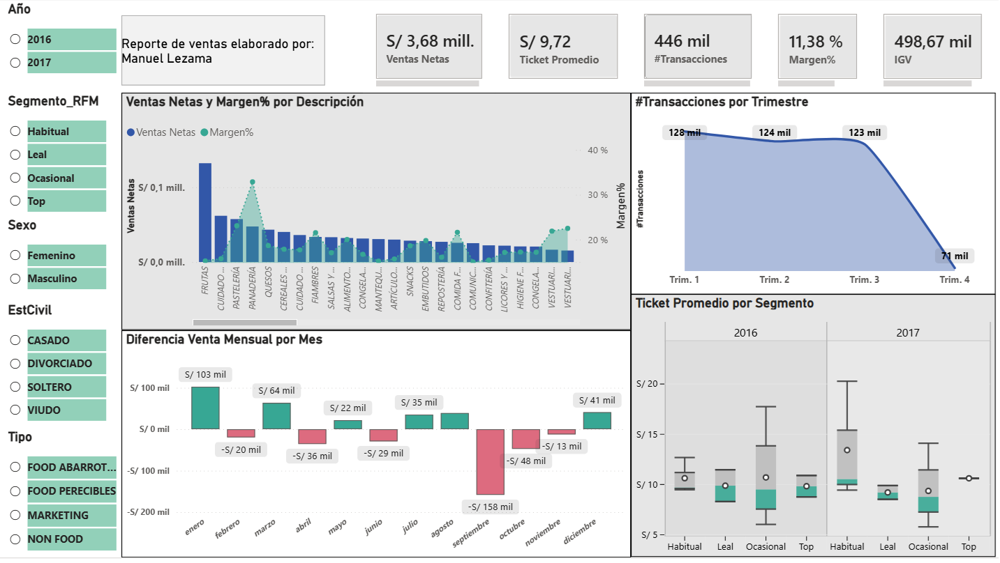

# 🛒 Retail Data Pipeline & Analytics Dashboard

Proyecto End-to-End de ingeniería y análisis de datos enfocado en el sector retail. La solución procesa datos transaccionales masivos mediante una arquitectura Medallion en Databricks y los expone a través de un modelo interactivo en Power BI para la toma de decisiones comerciales.

https://app.powerbi.com/view?r=eyJrIjoiOTU4ZjdlMDYtMDdlYi00NTQ0LTg2MTQtMDU4NTg5N2FhZjE1IiwidCI6IjBlMGNiMDYwLTA5YWQtNDlmNS1hMDA1LTY4YjliNDlhYTFmNiIsImMiOjR9

---

## 🏗️ Arquitectura y Tecnologías
* **Procesamiento de Datos:** Databricks, PySpark, Spark SQL, Python
* **Arquitectura de Datos:** Medallion (Bronze ➡️ Silver ➡️ Gold)
* **Visualización y BI:** Power BI, DAX, DirectQuery
* **Control de Versiones:** GitHub

---

## ⚙️ Fases del Desarrollo

### 1. Ingesta y Almacenamiento (Capa Bronze)
* Recepción e ingesta de los archivos y tablas transaccionales originales sin alteraciones en Databricks.
* Almacenamiento de los datos en formato crudo para mantener una auditoría y respaldo fiel de las fuentes de origen.

### 2. Limpieza y Transformación (Capa Silver)
* Identificación de 5 valores nulos en el campo 'EstCivil' en la tabla 'Clientes'. Se procedió a eliminar estos registros. 
* Desarrollo de scripts en **PySpark** para eliminar 3 campos (`Mes`, `Dia`, `Marca`).
* **Tratamiento de Anomalías:**
* Identificación de valor negativos en el campo 'VTABS'  
* Estandarización y renombrado de categorías de productos (`SKU`, `Producto`, `Descripción`, `Tipo`).
* Conversión de valores negativos a positivos en métricas financieras (`VTABS`, `Margen`, `VTAQ`).

### 3. Modelado y Capa Gold
* Consolidación y estructuración final de las tablas de hechos y dimensiones en Databricks, dejándolas optimizadas y listas para el consumo analítico mediante consultas eficientes.

### 4. Visualización y Reporte (Power BI)
* **Conexión de Datos:** Establecimiento de una conexión en vivo mediante **DirectQuery** desde Power BI Desktop directamente hacia las tablas optimizadas en la capa Gold de Databricks.
* **Cálculo de Métricas y Negocio:** Implementación de fórmulas y medidas (como Venta Neta aislando el IGV, Margen %, Ticket Promedio y segmentación RFM) directamente en el modelo semántico del reporte.
* **Diseño del Dashboard:** Creación de un informe ejecutivo interactivo estructurado para facilitar la lectura de los KPIs principales:
  * **Tarjetas de Resumen:** Visualización de métricas globales clave: Ticket Promedio, Total de Transacciones, % de Margen, Ventas Netas totales e IGV.
  * **Gráfico de Tendencia:** Análisis de la evolución trimestral del número de transacciones.
  * **Análisis de Rentabilidad:** Comparación de Ventas Netas y Margen % por cada categoría de producto (`Descripción`).
  * **Segmentación de Clientes:** Distribución de la base de clientes por sexo y filtros laterales para analizar el comportamiento según el Segmento RFM (Top, Leal, Habitual, Ocasional).
* **Publicación y Difusión:** Despliegue del reporte final en Power BI Service con la opción de acceso público mediante enlace web interactivo.
---

## 📊 Vista Previa del Dashboard

